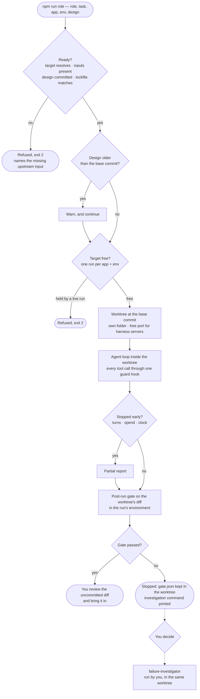
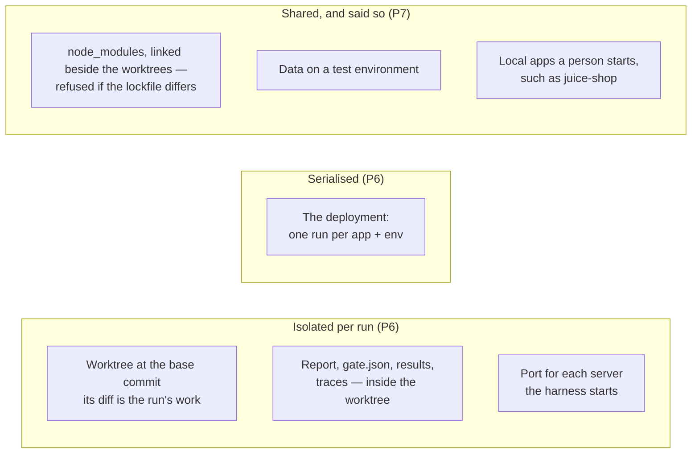
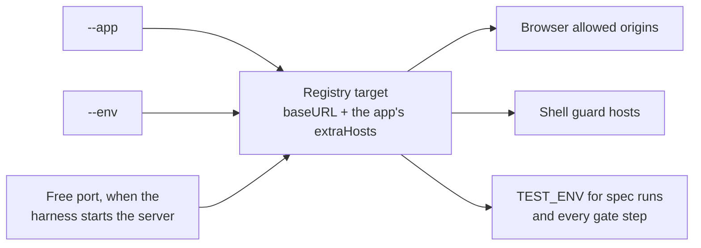
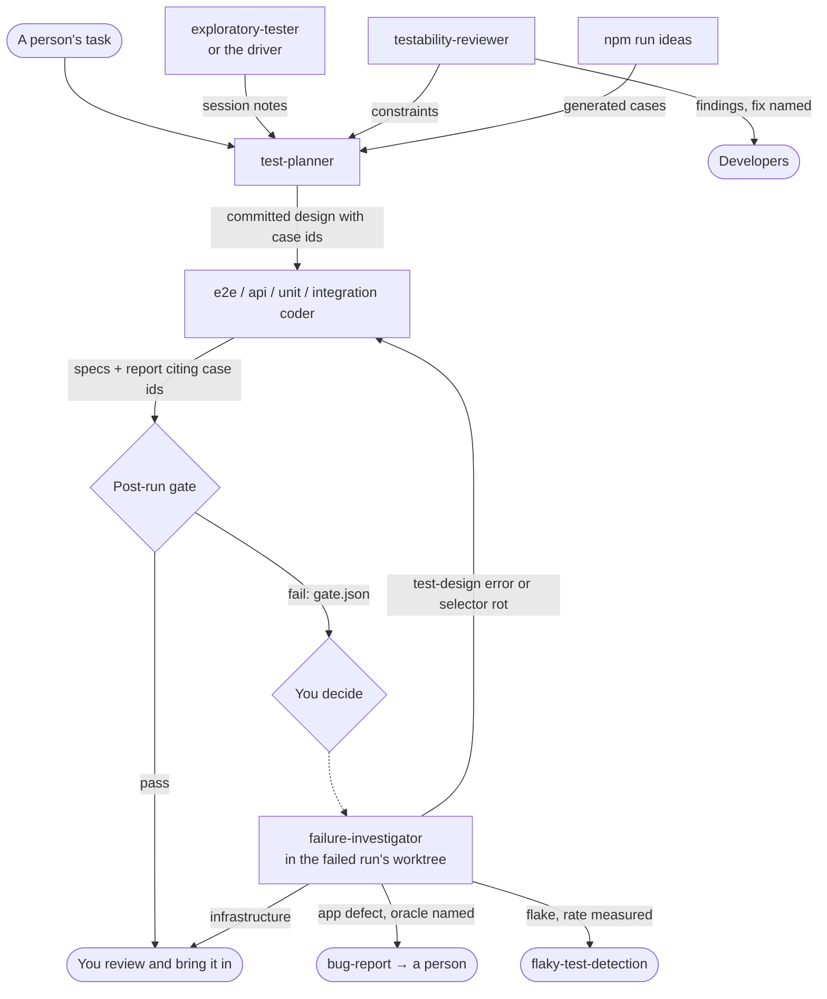

# Agent workflows — how a role run flows

**Status: decided and built on 2026-09-14.** Principles first, then the flows as diagrams,
then reference tables. What is enforced, what proves it, and what no live run has shown
yet is in the last section.

This file was written from drawings, not from reading code. Drawing the coder flow as it
ran exposed flaws that reading the files one at a time had not, and every later review
found more by drawing again. The method: draw the flow, look for a pointer nothing
follows, a step nothing enforces, a loop that never closes — then write.

## Principles

The mechanisms below will change. These are what they must keep true. A proposal that
breaks one is wrong however convenient, and a run of patches for one symptom after
another means a principle is broken underneath them.

| #   | Principle                                                        | What it rules out                                                                      |
| --- | ---------------------------------------------------------------- | -------------------------------------------------------------------------------------- |
| P1  | **Evidence decides, not the agent.**                             | A verdict resting on the agent's statement that its checks passed                      |
| P2  | **Bounded by construction, not by instruction.**                 | A limit that exists only in a prompt; a limit trusted before it is seen refusing live  |
| P3  | **One source of truth per fact.**                                | Two places saying where a run points, what to build, or how to work                    |
| P4  | **Refuse early, and name the gap.**                              | Defaults for anything risky; a run discovering mid-way that it could never have worked |
| P5  | **A person holds every irreversible or spending decision.**      | Automatic commits, merges, retries, or investigations                                  |
| P6  | **Isolate what the harness controls; serialise what it cannot.** | Shared files, results or servers between runs; parallel writes to one deployment       |
| P7  | **Say what is unproven.**                                        | A gap left implied, or a mechanism described as working before it has run              |

P6 was reached late. Before it, a run worked in the shared checkout, and every guarantee
about what it changed was patched in afterwards — a lock, a before-and-after comparison,
separate result folders — until a nested test run still deleted another run's traces.
Each patch fixed a symptom; a worktree per run removed the cause.

## The flaws this closes

| Code | What was wrong                                                                                                               |
| ---- | ---------------------------------------------------------------------------------------------------------------------------- |
| F1   | Nothing re-checked a run's work; the runner returned the agent's text                                                        |
| F2   | No check could show an app spec notices its server failing — mutation testing covers the harness's own rules only            |
| F3   | One 180-second wall clock for every role                                                                                     |
| F4   | A role's declared skills never reached a top-level run                                                                       |
| F5   | `Bash` was unguarded                                                                                                         |
| F6   | A design reached a coder only as task text                                                                                   |
| F7   | The browser guard sat on `canUseTool`, a permission handler that `bypassPermissions` may never consult                       |
| F8   | A run had two sources for where it points: `--target` for the browser and shell, the registry default for specs and the gate |
| G1   | A run's changes could not be told apart from a person's, or another run's                                                    |
| G2   | A design could describe code that had since changed, with nothing saying so                                                  |
| G3   | A host beyond the target had no way to be allowed                                                                            |
| G4   | A failed gate had no next owner                                                                                              |
| G5   | A server left by a crashed run was silently reused by the next                                                               |

G1–G5 came from external reviews of earlier drafts of this file.

## 1. One run, as decision states

Solid arrows are the runner. Dotted arrows are a person — nothing after a failed gate
starts by itself (P5).

| Step           | Closes         | Where                                                                                                          |
| -------------- | -------------- | -------------------------------------------------------------------------------------------------------------- |
| Ready?         | F6, F8         | `src/qe/readiness.ts`, `src/qe/run-target.ts`, `committedAt` and `lockfileProblem` in `src/qe/run-worktree.ts` |
| Design older?  | G2             | `stalenessWarning` in `src/qe/readiness.ts`                                                                    |
| Target free?   | P6             | `src/qe/run-lock.ts`, one lock per app and environment                                                         |
| Worktree       | G1, G5         | `src/qe/run-worktree.ts`; per-run ports through `portEnv` in `apps/targets.ts`                                 |
| Agent loop     | F3, F4, F5, F7 | `src/qe/tool-hook.ts`, `src/qe/shell-guard.ts`, `src/qe/file-guard.ts`, `src/agents/compose.ts`                |
| Stopped early? | —              | `src/agents/budget.ts` ends the run with a partial report; the gate still runs                                 |
| Post-run gate  | F1, F2         | `src/qe/run-gate.ts`, `npm run fault-check`                                                                    |
| Gate passed?   | G4             | `investigationCommand` in `src/qe/run-gate.ts`                                                                 |

**There is no override and no retry.** A failed gate is a finding. You decide whether to
investigate, and the investigator must prove the cause: a test-design error, app
behaviour with the oracle named, or flake shown by a measured failure rate. "Flaky",
asserted without that, is a claim.

## 2. What a run shares, and what it does not

- **Nobody else works in a run's worktree**, so everything changed there is the run's —
  whatever tool changed it. A person's edits in the main checkout never reach it.
- **A run tests committed code.** Its worktree is checked out at `HEAD`; an uncommitted
  design is refused rather than silently absent.
- **The file tools cannot leave the worktree.** `Bash` can `cd` out; the shell guard
  refuses git writes, secrets and foreign hosts there, not every path.
- **The work comes back uncommitted**, in the worktree. You review it, bring it in, and
  remove the worktree. Nothing merges by itself. git refuses a plain
  `git worktree remove` while uncommitted work is there, which protects it; once the
  work is in, `--force` discards the rest.

## 3. Where a run points

One resolution, every consumer. `--app` names a registered app, `--env` one of its
environments, and `targetFor` in `apps/targets.ts` resolves the rest.

**Widening (G3)** happens in one place: `extraHosts` in the app's `app.config.ts`,
reviewed in a commit and shown by `npm run targets`. An agent cannot change it mid-run.

## 4. Handoffs between roles

The investigator runs **in the failed run's worktree** (`--worktree`), because the
failing specs exist nowhere else. It is a testing role and holds no Edit, so it cannot
change the evidence it investigates.

The design lives in `apps/<app>/designs/<feature>.md` as a `report: test-design` with
`cases` and the `commit` it was written against. `npm run ideas` output is copied into
it with ids, so a coder implements generated cases rather than deriving them again.

## 5. Reference

### Definition of ready

Refused runs exit 2 and name what is missing. The checks are mechanical — whether a
design or a charter is any good is not decided here.

| Role                              | Ready when it has                                                                                        |
| --------------------------------- | -------------------------------------------------------------------------------------------------------- |
| `e2e-coder`, `api-coder`          | `--app`, `--env`, and `--design` naming a committed test design that lists cases                         |
| `unit-coder`, `integration-coder` | `--design`, or the harness module path named in the task — no app                                        |
| `test-planner`                    | `--app`, or a path in the task to cite                                                                   |
| `exploratory-tester`              | `--app`, `--env`, and a charter with `Explore` and `Timebox` lines                                       |
| `testability-reviewer`            | `--app` and `--env`                                                                                      |
| `failure-investigator`            | `--worktree` of the failed run, and its `gate.json` named in the task. `--app` and `--env` add a browser |

Every run also needs the checkout's `package-lock.json` to match the base commit, since
worktrees use the checkout's `node_modules` through a link in the runs folder — beside
them, never inside one, where `git worktree remove` would follow it and delete the
checkout's modules.

### The post-run gate

It runs inside the worktree, on everything changed there.

| Role family                  | Checks                                                                                                                       |
| ---------------------------- | ---------------------------------------------------------------------------------------------------------------------------- |
| coding                       | `assert-quality` on changed specs · the changed specs run, with `TEST_ENV` · `fault-check` on changed app specs · the report |
| `testability-reviewer`       | the report                                                                                                                   |
| `test-planner`               | at least one design written, each passing `check-report` · the report                                                        |
| `exploratory-tester`, others | the report · session format **not run** until E6                                                                             |

### The guards

One `PreToolUse` hook carries every guard; a guard that throws refuses the call.

- **File tools** (`src/qe/file-guard.ts`): every path inside the worktree, reads
  included; `.env` refused even there.
- **Shell** (`src/qe/shell-guard.ts`): git writes · `TEST_ENV` or `EXPLORE_ENV` other
  than the run's · a host not the app's own or in its `extraHosts` (loopback allowed) ·
  reading `.env` or a credential store · `npm run role` from inside a run. It reads the
  command as written: a guard against accident, not an adversary.
- **Browser** (`src/qe/browser-guard.ts`): the exploration policy's labels and action
  ceiling, on top of the tool allowlist and allowed origins.

### Decided on 2026-09-14

| Question                   | Decision                                                    | Declined                                                         |
| -------------------------- | ----------------------------------------------------------- | ---------------------------------------------------------------- |
| Separating a run's effects | A git worktree per run                                      | A lock on the shared checkout with edit tracking                 |
| How the work comes back    | Uncommitted, in the worktree                                | A run branch the runner commits; a patch file only               |
| Servers the harness starts | A free port per run                                         | A fixed port refused when taken                                  |
| Two runs on one deployment | A lock per app and environment                              | A lock per checkout                                              |
| A failed gate              | Stop; a person starts an investigation that proves cause    | Override per finding; retry; quarantine; automatic investigation |
| How a role gets its skills | Injected by the runner                                      | Agent reads the files; a short index                             |
| Where a design lives       | `apps/<app>/designs/`, committed, with `cases` and `commit` | Growing `coverage.md`; a gitignored artefact                     |
| Where a run points         | `--app` + `--env`, resolved through the registry            | `--target` beside `--env`                                        |
| A second host              | `extraHosts` in the app config                              | A per-run flag; never widen                                      |
| A stale design             | Warn                                                        | Refuse                                                           |
| How a guard reaches a run  | One `PreToolUse` hook, fail-closed                          | `canUseTool`                                                     |

### Decided on 2026-09-18

| Question                       | Decision                                                                                                                                      | Declined                                                                             |
| ------------------------------ | --------------------------------------------------------------------------------------------------------------------------------------------- | ------------------------------------------------------------------------------------ |
| Where the driver's state lives | A **CDP-shared browser**: the harness launches Chromium, hands Playwright MCP `--cdp-endpoint`, and keeps its own Playwright connection to it | A `PostToolUse` hook parsing snapshot text; a deterministic driver CLI with no agent |
| What the driver decides        | Which actions are **possible and permitted** — `ideasFor` narrowed by the policy                                                              | Which action is most worth taking; that stays judgement, per `heuristics.ts`         |

Both mechanisms were checked before choosing, not assumed: the SDK does carry
`PostToolUse` with `tool_response`, and `@playwright/mcp` does accept `--cdp-endpoint`.
`PostToolUse` was declined because state would be derived from the model-facing snapshot
text — which forces `--snapshot-mode full`, the expensive way to look, and loses
`fieldName`, `constraints` and `ancestors`, most of the redundant signals `identity.ts`
exists for.

### Decided on 2026-09-19

| Question                             | Decision                                                                                     | Declined                                                                          |
| ------------------------------------ | -------------------------------------------------------------------------------------------- | --------------------------------------------------------------------------------- |
| Destructive actions on the test tier | **Permitted** — `allowDestructive: true`, and `DESTRUCTIVE_LABELS` dropped from `denyLabels` | Leaving it refused; a per-app override for one subject only                       |
| Whether the two halves move together | Together                                                                                     | Flipping the flag alone, which grants the tools and still refuses "Reset" by name |

The user's decision, and it is worth stating what it costs. `allowDestructive` is one
flag governing two different things: which browser tools an agent holds, and — through
`grepForPolicy` in `apps/targets.ts` — **which Playwright specs run at all**. So a test
deployment now also runs `@destructive` specs, and untagged ones whose effect nobody
declared, exactly as local does. That is a wider blast radius than the browser policy
that motivated the change.

What still protects a test deployment: the outbound labels (never permitted anywhere),
`maxActions`, `maxStates`, `stayOnOrigin`, and one run per app and environment at a
time. If the spec half proves too loose, the fix is to split the flag —
`allowSessionReset` for cookies and storage, `allowDestructive` for controls that
destroy data — not to quietly narrow the tests that now pin this behaviour.

### Open

- **The driver (E5)** — a mode of `exploratory-tester`, or a role of its own. **E5a is
  built**: `src/qe/driver.ts` joins `ideasFor` to the policy, and a `--scan` run now
  carries candidate actions and named refusals into the briefing. **E5b is built**: the
  run launches Chromium with a debugging port, hands the endpoint to Playwright MCP,
  and reads the live DOM over its own connection after every call that can move the
  page — so `maxStates` is enforced rather than described. **E5c**, choosing the next
  action from the diff, is not; the driver narrows and does not choose.
- **A test-reviewer role**, judging whether a finished spec's assertions are good enough.
- **`oracle-check` for coders** — an assertion is an oracle written down.

## 6. Status

Built on 2026-09-14, each rule with a test in both directions and a mutation. **No live
agent run has gone through any of it**, so the last column is what one must show.

| Code | Proven by                                                                                                    | Not yet shown                                                     |
| ---- | ------------------------------------------------------------------------------------------------------------ | ----------------------------------------------------------------- |
| F1   | `tests/unit/run-gate.test.ts`                                                                                | the gate after a real agent run                                   |
| F2   | `tests/unit/fault.test.ts`, `tests/integration/fault-check.int.test.ts` on real specs                        | only a 500 is tried; an API spec using absolute URLs is untouched |
| F3   | `tests/unit/wall-clock.test.ts`, `tests/unit/models.test.ts`                                                 | the values are estimates                                          |
| F4   | `tests/unit/compose.test.ts`                                                                                 | the token cost per run                                            |
| F5   | `tests/unit/shell-guard.test.ts`                                                                             | a refusal in a live run                                           |
| F6   | `tests/unit/readiness.test.ts`, `tests/unit/design-report.test.ts`                                           | no design file exists yet under `apps/`                           |
| F7   | `tests/unit/tool-hook.test.ts`                                                                               | which path the SDK actually calls under `bypassPermissions`       |
| F8   | `tests/unit/run-target.test.ts`, `tests/unit/run-gate.test.ts`                                               | a run against an app with more than one environment               |
| G1   | `tests/integration/run-worktree.int.test.ts` against a throwaway repository; `tests/unit/file-guard.test.ts` | an agent run inside a worktree                                    |
| G2   | `tests/unit/readiness.test.ts`                                                                               | a design with a `commit` field                                    |
| G3   | `tests/unit/shell-guard.test.ts`, `tests/unit/browser-tools.test.ts`                                         | no app declares `extraHosts` yet                                  |
| G4   | `tests/unit/run-gate.test.ts`                                                                                | an investigator started from a real `gate.json`                   |
| G5   | `tests/unit/target-port.test.ts`                                                                             | two runs of the fixture side by side                              |

**Not closed, and said so (P7):**

- **Cleanup after a stopped run is not proven.** The runner releases its lock on exit and
  on Ctrl+C. Nothing shows the browser server and any process a test started die with it.
- **Worktrees accumulate.** A person removes each one after review; nothing lists or
  prunes them yet.
- **`Bash` can leave the worktree.** The file tools cannot; the shell is bounded only by
  what its guard reads in the command.
- **Test data between runs is only partly isolated.** The target lock stops two runs
  writing to one deployment at once. There is no seeding or teardown, so a writing run
  on `test` can leave data the next run meets.
- **Local apps a person starts are not checked.** A run assumes such an app is up at its
  configured URL; only servers the harness starts get their own port.
- **Runs are local.** Reports and gate records live in the worktree's `artifacts/`,
  which is not committed. If runs move into CI, both must be uploaded as build outputs.
